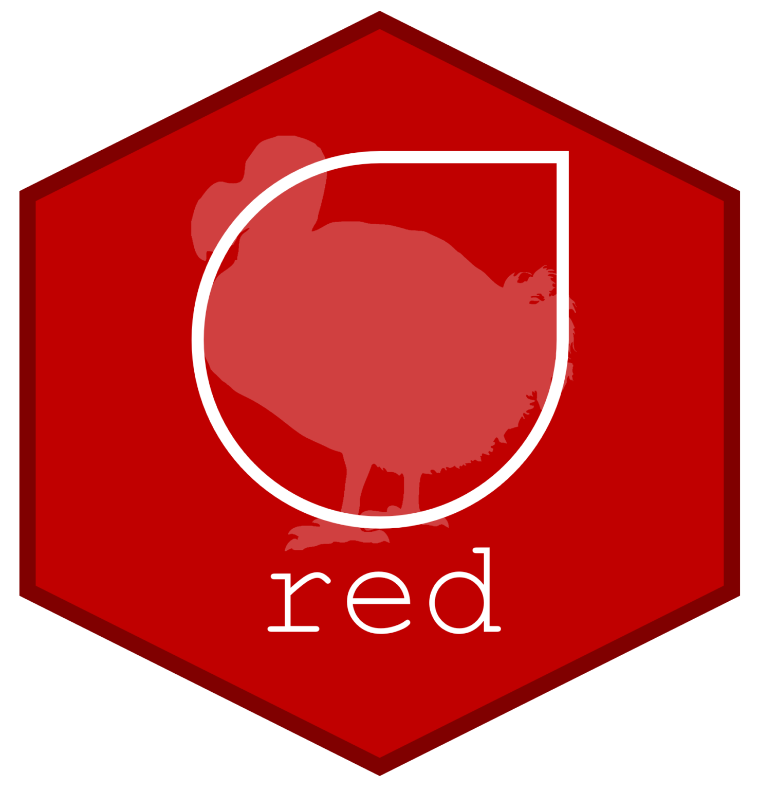

# red: IUCN Redlisting Tools 

red is an *R* package and suite of functions designed to facilitate the assessment of extinction risk of species according to the [IUCN](https://www.iucn.org) (International Union for Conservation of Nature) red list criteria. These include calculating the Extent of Occurrence (EOO), Area of Occupancy (AOO), mapping species ranges, modelling species distributions using climate and land cover and calculating the Red List Index for groups of species.

## Installation
As gecko is available from CRAN, you can use `install.packages("red")` to get the current released version. Alteratively, install the latest release through `remotes::install_github("VascoBranco/red")`.

## References
 * Cardoso, P. (2017). Red – an R package to facilitate species red list assessments according to the IUCN criteria. *Biodiversity Data Journal*, 5: e20530. [https://doi.org/10.3897/BDJ.5.e20530](https://doi.org/10.3897/BDJ.5.e20530)
